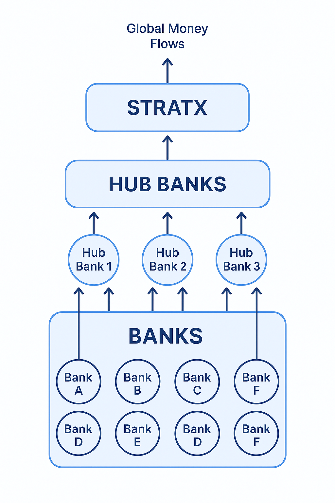

# StratX and the Global Banking System

## The Hidden Architecture of Money

The global financial system looks fragmented — thousands of banks, clearinghouses, and payment networks.  
But in reality, it operates like a **hub-and-spoke network**.

- **Regional banks** don’t clear directly with each other.  
- Instead, they route through a small group of **Global Systemically Important Banks (GSIBs)** — institutions like JPMorgan, Citi, HSBC, Deutsche Bank, BNP Paribas, and a handful of others.  
- These GSIBs act as **financial hubs**, settling transactions on behalf of hundreds or even thousands of smaller banks.  
- Overlaying this are **central rails** like SWIFT, FedWire, CHIPS, TARGET2, CLS, and CBDC pilots — all of which ultimately interconnect through these same hubs.

This means: **the flow of money worldwide already concentrates through fewer than 10 super-nodes.**

---

## Why StratX Is Different

StratX is not another payment app or crypto project. It is a **programmable financial-infrastructure protocol** designed to:

- Orchestrate **routing, conversion, and settlement** across fiat rails, stablecoins, CBDCs, and tokenized assets.  
- Enforce **jurisdictional compliance and sanctions** in real time.  
- Provide **fallback routing** through sovereign-grade rails (FedNow, FedWire, etc.) during outages or attacks.  
- Integrate directly with **institutional and government transaction layers**.

Instead of replacing banks, StratX **plugs into them**. By connecting directly to the hubs that already clear the world’s flows, StratX becomes the **invisible switchboard** of global liquidity.

---

## The Power of Control

- With just **6–8 GSIB integrations**, StratX would indirectly reach **95%+ of global money flows**.  
- With only **3 banks (JPMorgan, Citi, HSBC)**, the system would already capture the majority of cross-border settlement volume, because nearly every other bank routes through them.  
- Whoever controls StratX does not just control a bank, a currency, or a blockchain.  
  - They control **the routing logic**.  
  - And routing logic determines **where, how, and under what rules money moves**.

This is the equivalent of owning the **SWIFT of the future**, but programmable, compliance-aware, and spanning every asset class — fiat, stablecoins, CBDCs, and tokenized real-world assets.

---

## Why This Matters

- Governments see StratX as a **national-security-grade backplane** for enforcing sanctions and ensuring resilience under geopolitical stress.  
- Institutions see StratX as the **only unified orchestration layer** that can reduce cost, latency, and fragmentation.  
- Developers see StratX as the **missing protocol** that allows AI agents, fintech apps, and Web3 wallets to settle money like the internet routes data.  

---

## Visual Overview

Here’s a simplified look at how StratX integrates into the global banking system:

---

## The Bottom Line

> **Whoever controls StratX will control the single protocol through which every dollar, euro, yen, pound, yuan, and token flows.**

This isn’t about building the next “app” — it’s about **owning the operating system of global finance**.

---

## Attribution
Invented by **Abel Justin Oliveira**,  
Creator of StratX: *Programmable Financial Infrastructure for Global Liquidity Control*.
